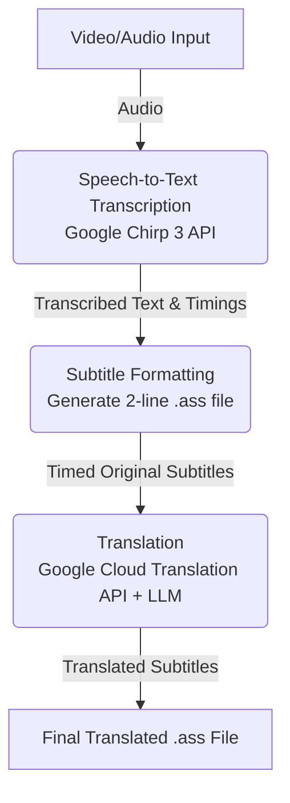

# autosub

Automatic video subbing and translation toolchain powered by AI.

## Overview

`autosub` is a CLI toolchain for generating high-quality Japanese subtitles and translations for speech-focused videos. It transcribes speech, formats readable `.ass` subtitles, and translates them with Google-backed models.

## Product Roadmap

### Minimum Viable Product (MVP)

The current version of `autosub` focuses on accurate, timed, and translated subtitles for single-speaker Japanese speech.

The MVP workflow consists of the following steps:
1. **Speech-to-Text Transcription**: Utilize Google Speech-to-Text to transcribe single-speaker Japanese video or audio.
2. **Subtitle Formatting (.ass)**: Convert the transcript into a readable `.ass` (Advanced SubStation Alpha) file with semantic chunking, minimum-duration timing rules, optional scene-aware snapping, and automatic wrapping to keep subtitles within two visible lines.
3. **Translation**: Translate each individual line using the Google Cloud Translation API, augmented with an LLM for context-aware and natural phrasing.



### Future Features & Enhancements

Following the MVP, the toolchain will be expanded with advanced capabilities:

- **Advanced Timing Rules**: Continue refining professional subtitling rules around line length, scene-aware timing, and gap handling for single-speaker dialogue.
- **On-Screen Text OCR**: Implement optical character recognition (OCR) on the video footage to generate subtitle lines for signs, lower thirds, and other important on-screen text.
- **Audio Segmentation (Speech vs. Singing)**: Intelligently ignore singing sections (to be handled by separate specialized modules) and exclusively generate audio/subtitle lines for spoken sections.

## Getting Started

### Prerequisites
1. **Python 3.12+** and `uv` installed.
2. **FFmpeg**: Must be available on your system path (e.g., `winget install ffmpeg`).
3. **Optional Keyframe Tooling**: Install `SCXvid` if you want automatic keyframe extraction for scene-aware subtitle snapping. Without it, the pipeline still runs and simply skips keyframe extraction.
4. **Google Cloud Account**:
   - A Service Account JSON key with `Cloud Speech Administrator` and `Storage Object Admin`.
   - A Google Cloud Storage Bucket (required for videos >1 minute).

### Installation
Clone the repository and install the dependencies using `uv`:
```bash
git clone https://github.com/yourusername/autosub.git
cd autosub
uv sync
```

### Configuration
Create a `.env` file in the root directory with your Google Cloud credentials:
```bash
GOOGLE_APPLICATION_CREDENTIALS="C:\path\to\your\key.json"
AUTOSUB_GCS_BUCKET="your-staging-bucket-name"
GOOGLE_CLOUD_PROJECT="your-project-id"
```

### Usage

The easiest way to process a video is using the end-to-end `run` command.

**Full Pipeline (Transcribe -> Format -> Translate)**
```bash
uv run autosub run path/to/video.mp4 --profile date_sayuri
```
This will automatically generate three files in the video's directory: `transcript.json`, `original.ass`, and `translated.ass`.

#### Unified Profiles (TOML)
`autosub` uses composable TOML profiles. You can configure custom vocabulary, translation instructions, and subtitle timing/layout rules in a single file located in the `profiles/` directory.

Example `profiles/date_sayuri.toml`:
```toml
# Inherits rules and vocab from another profile!
extends = ["base_radio_profile"]

# Points to an external markdown file for LLM instructions
prompt = "prompts/date_sayuri.md"

# Custom hints for Speech-to-Text
vocab = [
    "Date Sayuri",
    "Sayurin"
]

[timing]
min_duration_ms = 500
snap_threshold_ms = 250
conditional_snap_threshold_ms = 500
max_line_width = 22
max_lines_per_subtitle = 2
```

By passing `--profile date_sayuri`, the pipeline will automatically apply these settings to transcription, formatting, and translation.

---

### Individual Step Execution

You can also run each step of the pipeline manually. All commands accept `--profile`.

**Step 1: Transcribe Audio**
Extracts the audio, processes it via Google Speech-to-Text, and saves a timestamped `.json` transcript.
```bash
uv run autosub transcribe video.mp4 --out transcript.json --profile date_sayuri
```
`--speakers` remains reserved for future diarization work and is ignored by the current single-speaker pipeline.

**Step 2: Subtitle Formatting (.ass)**
Converts the JSON transcript into a timed `.ass` subtitle file using semantic chunking, scene-aware timing rules, and Japanese-first two-line wrapping.
```bash
uv run autosub format transcript.json --out original.ass
```

To enable scene-aware snapping from an existing Aegisub keyframe log, provide both the keyframe file and the source FPS:
```bash
uv run autosub format transcript.json --out original.ass --keyframes video_keyframes.log --fps 23.976
```

The end-to-end `run` command can also extract keyframes automatically when `SCXvid` is installed. If it is not installed, the pipeline logs a warning and continues without keyframe snapping.

**Step 3: Translation**
Translates the `.ass` file using a pluggable translation engine. By default, it uses high-quality context-aware translation via **Gemini 2.5 Flash on Vertex AI**.
```bash
uv run autosub translate original.ass --out translated.ass --profile date_sayuri
```

#### Translation Engines
- `vertex` (Default): Uses Gemini 2.5 Flash for context-aware, high-quality translation.
- `cloud-v3`: Uses the standard Google Cloud Translation V3 (Literal translation fallback).

```bash
uv run autosub translate original.ass --engine cloud-v3
```
