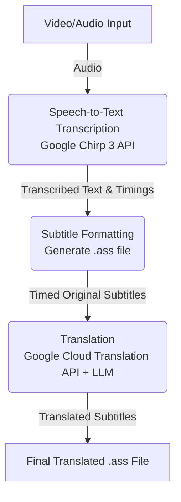

# autosub

Automatic video subbing and translation toolchain powered by AI.

## Overview

`autosub` is a comprehensive toolchain designed to automatically generate high-quality subtitles and translations for videos. It leverages state-of-the-art AI models to transcribe speech, format timings, and translate content.

## Product Roadmap

### Minimum Viable Product (MVP)

The initial version of `autosub` focuses on generating accurate, timed, and translated subtitles for specific speaking-focused videos.

The MVP workflow consists of the following steps:
1. **Speech-to-Text Transcription**: Utilize the Google Chirp 3 API to transcribe video audio.
2. **Subtitle Formatting (.ass)**: Bundle the transcribed text and speaker information into a `.ass` (Advanced SubStation Alpha) file, accurately timed to individual lines and sentences.
3. **Translation**: Translate each individual line using the Google Cloud Translation API, augmented with an LLM for context-aware and natural phrasing.



### Future Features & Enhancements

Following the MVP, the toolchain will be expanded with advanced capabilities:

- **Multi-Speaker Support**: Handle complex audio environments, such as livestreams or group concert footage, with accurate speaker diarization and identification.
- **Advanced Timing Rules**: Shift and adjust `.ass` line timings to adhere to professional subtitling best practices:
  - Limit text lines on screen to a maximum of 2.
  - Ensure there are no awkward gaps between consecutive lines.
  - Snap subtitle lines to video keyframes for smoother transitions.
- **On-Screen Text OCR**: Implement optical character recognition (OCR) on the video footage to generate subtitle lines for signs, lower thirds, and other important on-screen text.
- **Audio Segmentation (Speech vs. Singing)**: Intelligently ignore singing sections (to be handled by separate specialized modules) and exclusively generate audio/subtitle lines for spoken sections.

## Getting Started

### Prerequisites
1. **Python 3.12+** and `uv` installed.
2. **FFmpeg**: Must be available on your system path (e.g., `winget install ffmpeg`).
3. **Google Cloud Account**:
   - A Service Account JSON key with `Cloud Speech Administrator` and `Storage Object Admin`.
   - A Google Cloud Storage Bucket (required for videos >1 minute).

### Installation
Clone the repository and install the dependencies using `uv`:
```bash
git clone https://github.com/yourusername/autosub.git
cd autosub
uv sync
```

### Configuration
Create a `.env` file in the root directory with your Google Cloud credentials:
```bash
GOOGLE_APPLICATION_CREDENTIALS="C:\path\to\your\key.json"
AUTOSUB_GCS_BUCKET="your-staging-bucket-name"
GOOGLE_CLOUD_PROJECT="your-project-id"
```

### Usage

**Step 1: Transcribe Audio**
You can use the built-in CLI to run the Speech-to-Text module. This will extract the audio from your video, process it via Google Cloud Chirp 3, and save a word-level timestamped `.json` transcript.

```bash
uv run autosub transcribe path/to/video.mp4 --out transcript.json
```

**Advanced Transcription (Custom Vocabulary)**
If your audio contains domain-specific terminology, proper nouns, or unique vocabulary (e.g. VTuber agency names, lore terms), you can provide "hints" to improve the Chirp 3 API's transcription accuracy using Google Cloud Speech Adaptation.

Pass individual words via the command line:
```bash
uv run autosub transcribe video.mp4 -v "Hololive" -v "Pekora"
```

Or pass a JSON file containing a list of strings:
```bash
uv run autosub transcribe video.mp4 --vocab-file agency_terms.json
```
