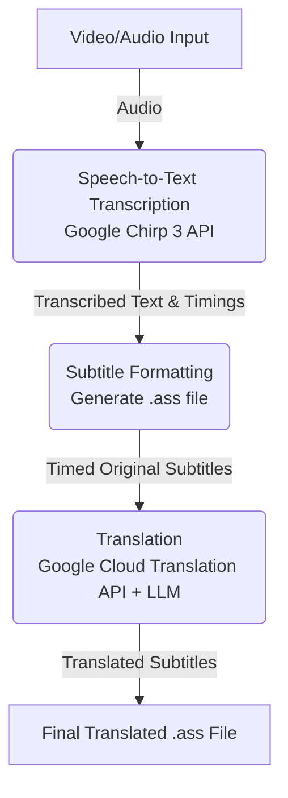

# autosub

Automatic video subbing and translation toolchain powered by AI.

## Overview

`autosub` is a comprehensive toolchain designed to automatically generate high-quality subtitles and translations for videos. It leverages state-of-the-art AI models to transcribe speech, format timings, and translate content.

## Product Roadmap

### Minimum Viable Product (MVP)

The initial version of `autosub` focuses on generating accurate, timed, and translated subtitles for specific speaking-focused videos.

The MVP workflow consists of the following steps:
1. **Speech-to-Text Transcription**: Utilize the Google Chirp 3 API to transcribe video audio.
2. **Subtitle Formatting (.ass)**: Bundle the transcribed text and speaker information into a `.ass` (Advanced SubStation Alpha) file, accurately timed to individual lines and sentences.
3. **Translation**: Translate each individual line using the Google Cloud Translation API, augmented with an LLM for context-aware and natural phrasing.



### Future Features & Enhancements

Following the MVP, the toolchain will be expanded with advanced capabilities:

- **Multi-Speaker Support**: Handle complex audio environments, such as livestreams or group concert footage, with accurate speaker diarization and identification.
- **Advanced Timing Rules**: Shift and adjust `.ass` line timings to adhere to professional subtitling best practices:
  - Limit text lines on screen to a maximum of 2.
  - Ensure there are no awkward gaps between consecutive lines.
  - Snap subtitle lines to video keyframes for smoother transitions.
- **On-Screen Text OCR**: Implement optical character recognition (OCR) on the video footage to generate subtitle lines for signs, lower thirds, and other important on-screen text.
- **Audio Segmentation (Speech vs. Singing)**: Intelligently ignore singing sections (to be handled by separate specialized modules) and exclusively generate audio/subtitle lines for spoken sections.

## Getting Started

### Prerequisites
1. **Python 3.12+** and `uv` installed.
2. **FFmpeg**: Must be available on your system path (e.g., `winget install ffmpeg`).
3. **Google Cloud Account**:
   - A Service Account JSON key with `Cloud Speech Administrator` and `Storage Object Admin`.
   - A Google Cloud Storage Bucket (required for videos >1 minute).

### Installation
Clone the repository and install the dependencies using `uv`:
```bash
git clone https://github.com/yourusername/autosub.git
cd autosub
uv sync
```

### Configuration
Create a `.env` file in the root directory with your Google Cloud credentials:
```bash
GOOGLE_APPLICATION_CREDENTIALS="C:\path\to\your\key.json"
AUTOSUB_GCS_BUCKET="your-staging-bucket-name"
GOOGLE_CLOUD_PROJECT="your-project-id"
```

### Usage

The easiest way to process a video is using the end-to-end `run` command.

**Full Pipeline (Transcribe -> Format -> Translate)**
```bash
uv run autosub run path/to/video.mp4 --profile date_sayuri
```
This will automatically generate three files in the video's directory: `transcript.json`, `original.ass`, and `translated.ass`.

#### Unified Profiles (TOML)
`autosub` uses a powerful, composable profile system powered by TOML. You can configure custom vocabulary (to help Chirp 3 recognize domain-specific names) and LLM translation instructions (to guide Gemini's tone) in a single file located in the `profiles/` directory!

Example `profiles/date_sayuri.toml`:
```toml
# Inherits rules and vocab from another profile!
extends = ["base_radio_profile"]

# Points to an external markdown file for LLM instructions
prompt = "prompts/date_sayuri.md"

# Custom hints for Speech-to-Text
vocab = [
    "Date Sayuri",
    "Sayurin"
]
```

By passing `--profile date_sayuri`, the pipeline will automatically apply these settings to both the transcription and translation stages.

---

### Individual Step Execution

You can also run each step of the pipeline manually. All commands accept the `--profile` argument.

**Step 1: Transcribe Audio**
Extracts the audio, processes it via Google Cloud Chirp 3, and saves a timestamped `.json` transcript.
```bash
uv run autosub transcribe video.mp4 --out transcript.json --profile date_sayuri
```
*(You can also pass individual vocabulary hints via `-v "Word"`).*

**Step 2: Subtitle Formatting (.ass)**
Converts the JSON transcript into a timed `.ass` subtitle file using semantic chunking rules (breaking at punctuation and pauses).
```bash
uv run autosub format transcript.json --out original.ass
```

**Step 3: Translation**
Translates the `.ass` file using a pluggable translation engine. By default, it uses high-quality context-aware translation via **Gemini 2.5 Flash on Vertex AI**.
```bash
uv run autosub translate original.ass --out translated.ass --profile date_sayuri
```

#### Translation Engines
- `vertex` (Default): Uses Gemini 2.5 Flash for context-aware, high-quality translation.
- `cloud-v3`: Uses the standard Google Cloud Translation V3 (Literal translation fallback).

```bash
uv run autosub translate original.ass --engine cloud-v3
```
